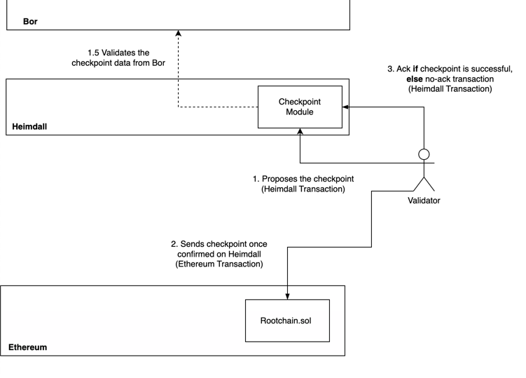
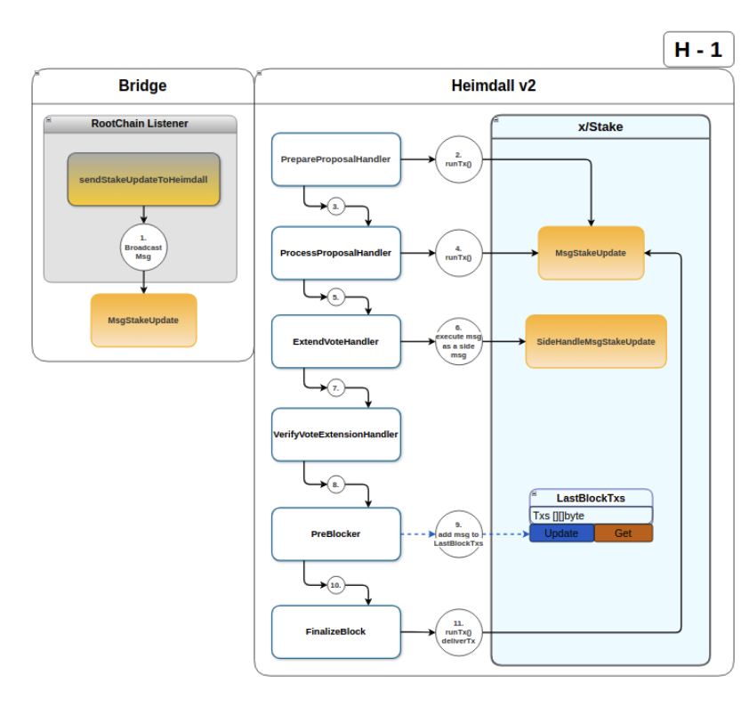

# Checkpoint Module

## Table of Contents

- [Overview](#overview)
- [Interact with the Node](#interact-with-the-node)
  - [Tx Commands](#tx-commands)
  - [CLI Query Commands](#cli-query-commands)
  - [GRPC Endpoints](#grpc-endpoints)
  - [REST Endpoints](#rest-endpoints)

## Overview

GiltConsensus selects the next proposer using Peppermint’s leader selection algorithm.  
The multi-stage checkpoint process is crucial due to potential failures when submitting checkpoints on the Ethereum chain caused by factors like gas limit, network traffic, or high gas fees.
Each checkpoint has a validator as the proposer.  
The outcome of a checkpoint on the Ethereum chain (success or failure) triggers an ack (acknowledgment) or no-ack (no acknowledgment) transaction,  
altering the proposer for the next checkpoint on GiltConsensus.



## Flow

### Checkpoint Proposal

A checkpoint proposal is initiated by a proposer, a validator with POL tokens staked on the L1 Ethereum root chain.  
The checkpointing process is managed by the `bridge processor` which generates a `MsgCheckpoint` and broadcasts it as a transaction.

- The proposer derives the root hash from the Gilt chain contract.
- Due to Gilt’s finality time, the root hash may not always reflect the latest Gilt tip.

### Checkpoint Processing in GiltConsensus

Once the checkpoint message is included in a GiltConsensus block,
it undergoes processing through the message handling system.  
Each validator node independently verifies the checkpoint
by checking the Gilt root hash provided in the message against its local Gilt chain.

### ABCI++ Processing Flow for the checkpoint submission on GiltConsensus

- `Prepare Proposal`: During the proposal phase, the checkpoint message `MsgCheckpoint` is included in the proposed block only if dry-running this tx does not return any errors.
- `Process Proposal`: The proposal is validated to ensure correctness.
- `Pre-Commit`: As part of the voting process, validators execute a side transaction to verify the checkpoint against their local Gilt data.
  If the checkpoint is valid, validators include a vote extension confirming their approval.
- `Verify Vote`: Injected votes are verified.  
  • `Next block - Finalize`: In the next block, the finalized votes are processed, and the checkpoint is considered approved if a sufficient majority supports it.  
  The `preBlocker` triggers post-tx handlers performing the GiltConsensus state changes when the checkpoint is finally saved in the checkpoint buffer as the checkpoint that needs to be further bridged to the Ethereum L1 root chain.

### Submission to Ethereum (L1)

Once approved, the checkpoint is added to a checkpoint buffer and an event is emitted. The bridge system, which listens for these events, submits the checkpoint data along with validator signatures to the Ethereum root chain.

### Acknowledgment from Ethereum (L1)

After the checkpoint is successfully included on the Ethereum chain, an acknowledgment `MsgCpAck` is sent back to GiltConsensus from the bridge processor.  
This acknowledgment, once processed through the ABCI++ flow with side and post-tx handlers: updates the state, flushes processed checkpoints from the buffer, and increments the number of ACK counters to track confirmations of checkpoints.  
Additionally, the selection of the next checkpoint proposer is adjusted based on the updated state.

### Missing Checkpoint Acknowledgment from Ethereum (L1)

The `MsgCpNoAck` message is broadcast by the bridge processor to indicate that a checkpoint was potentially transferred to the Ethereum chain but has not received an acknowledgment.  
A background routine periodically checks for time elapsed and publishes the No-ACK signal. No-ACK is sent if a sufficient amount of time has passed since:

- the last checkpoint was created on the GiltConsensus v2 chain and
- the last No-ACK was issued.  
  To conclude, the No-ACKs are triggered only when a checkpoint acknowledgment is overdue, ensuring they are not sent too frequently.  
  This message is broadcasted only by the proposer. This entire flow ensures that checkpoints are securely proposed, verified, and finalized across the GiltConsensus and Ethereum chains in a decentralized manner.



### Messages

#### MsgCheckpoint

`MsgCheckpoint` defines a message for creating a checkpoint on the Ethereum chain.

```protobuf
message MsgCheckpoint {
  option (cosmos.msg.v1.signer) = "proposer";
  option (amino.name) = "giltconsensusv2/checkpoint/MsgCheckpoint";
  option (gogoproto.equal) = true;
  option (gogoproto.goproto_getters) = true;
  string proposer = 1 [
    (amino.dont_omitempty) = true,
    (cosmos_proto.scalar) = "cosmos.AddressString"
  ];
  uint64 start_block = 2 [ (amino.dont_omitempty) = true ];
  uint64 end_block = 3 [ (amino.dont_omitempty) = true ];
  bytes root_hash = 4 [ (amino.dont_omitempty) = true ];
  bytes account_root_hash = 5 [ (amino.dont_omitempty) = true ];
  string gilt_chain_id = 6 [ (amino.dont_omitempty) = true ];
}
```

#### MsgCpAck

`MsgCpAck` defines a message for creating the ack tx of a submitted checkpoint.

```protobuf
message MsgCpAck {
  option (cosmos.msg.v1.signer) = "from";
  option (amino.name) = "giltconsensusv2/checkpoint/MsgCpAck";
  option (gogoproto.equal) = false;
  option (gogoproto.goproto_getters) = true;
  string from = 1 [
    (amino.dont_omitempty) = true,
    (cosmos_proto.scalar) = "cosmos.AddressString"
  ];
  uint64 number = 2 [ (amino.dont_omitempty) = true ];
  string proposer = 3 [
    (amino.dont_omitempty) = true,
    (cosmos_proto.scalar) = "cosmos.AddressString"
  ];
  uint64 start_block = 4 [ (amino.dont_omitempty) = true ];
  uint64 end_block = 5 [ (amino.dont_omitempty) = true ];
  bytes root_hash = 6 [ (amino.dont_omitempty) = true ];
  bytes tx_hash = 7 [ (amino.dont_omitempty) = true ];
  uint64 log_index = 8 [ (amino.dont_omitempty) = true ];
}

```

#### MsgCheckpointNoAck

`MsgCpNoAck` defines a message for creating the no-ack tx of a checkpoint.

```protobuf
message MsgCpNoAck {
  option (cosmos.msg.v1.signer) = "from";
  option (amino.name) = "giltconsensusv2/checkpoint/MsgCpNoAck";
  option (gogoproto.equal) = false;
  option (gogoproto.goproto_getters) = true;
  string from = 1 [
    (amino.dont_omitempty) = true,
    (cosmos_proto.scalar) = "cosmos.AddressString"
  ];
}
```

## Interact with the Node

### Tx Commands

#### Send checkpoint

```bash
giltconsd tx checkpoint send-checkpoint --proposer=<proposer-address> --start-block=<start-block-number> --end-block=<end-block-number> --root-hash=<root-hash> --account-root=<account-root> --gilt-chain-id=<gilt-chain-id> --auto-configure=true/false
```

#### Send checkpoint ack
With autoconfiguration:  
```bash
giltconsd tx checkpoint send-ack --auto-configure=true --home /var/lib/gilt-consensus/
```

Or without autoconfiguration (you need to provide the following parameters):
```bash
giltconsd tx checkpoint send-ack --home /var/lib/gilt-consensus/ --tx-hash=<checkpoint-tx-hash> --log-index=<log-index> --header=<header> --proposer=<proposer-address> --auto-configure=false
```

#### Send checkpoint no-ack

```bash
giltconsd tx checkpoint checkpoint-no-ack --from <from>
```

## CLI Query Commands

One can run the following query commands from the checkpoint module:

- `get-params` - Get checkpoint params
- `get-overview` - Get checkpoint overview
- `get-ack-count` - Get checkpoint ack count
- `get-checkpoint` - Get checkpoint based on its number
- `get-checkpoint-latest` - Get the latest checkpoint
- `get-checkpoint-buffer` - Get the checkpoint buffer
- `get-last-no-ack` - Get the last no ack
- `get-next-checkpoint` - Get the next checkpoint
- `get-current-proposer` - Get the current proposer
- `get-proposers` - Get the proposers
- `get-checkpoint-list` - Get the list of checkpoints

```bash
giltconsd query checkpoint get-params
```

```bash
giltconsd query checkpoint get-overview
```

```bash
giltconsd query checkpoint get-ack-count
```

```bash
giltconsd query checkpoint get-checkpoint
```

```bash
giltconsd query checkpoint get-checkpoint-latest
```

```bash
giltconsd query checkpoint get-checkpoint-buffer
```

```bash
giltconsd query checkpoint get-last-no-ack
```

```bash
giltconsd query checkpoint get-next-checkpoint
```

```bash
giltconsd query checkpoint get-current-proposer
```

```bash
giltconsd query checkpoint get-proposers
```

```bash
giltconsd query checkpoint get-checkpoint-list
```

## GRPC Endpoints

The endpoints and the params are defined in the [checkpoint/query.proto](/proto/giltconsensusv2/checkpoint/query.proto) file.
Please refer to them for more information about the optional params.

```bash
grpcurl -plaintext -d '{}' localhost:9090 giltconsensusv2.checkpoint.Query/GetCheckpointParams
```

```bash
grpcurl -plaintext -d '{}' localhost:9090 giltconsensusv2.checkpoint.Query/GetCheckpointOverview
```

```bash
grpcurl -plaintext -d '{}' localhost:9090 giltconsensusv2.checkpoint.Query/GetAckCount
```

```bash
grpcurl -plaintext -d '{}' localhost:9090 giltconsensusv2.checkpoint.Query/GetCheckpointLatest
```

```bash
grpcurl -plaintext -d '{}' localhost:9090 giltconsensusv2.checkpoint.Query/GetCheckpointBuffer
```

```bash
grpcurl -plaintext -d '{}' localhost:9090 giltconsensusv2.checkpoint.Query/GetLastNoAck
```

```bash
grpcurl -plaintext -d '{"gilt_chain_id": <>}' localhost:9090 giltconsensusv2.checkpoint.Query/GetNextCheckpoint
```

```bash
grpcurl -plaintext -d '{}' localhost:9090 giltconsensusv2.checkpoint.Query/GetCurrentProposer
```

```bash
grpcurl -plaintext -d '{}' localhost:9090 giltconsensusv2.checkpoint.Query/GetProposers
```

```bash
grpcurl -plaintext -d '{}' localhost:9090 giltconsensusv2.checkpoint.Query/GetCheckpointList
```

```bash
grpcurl -plaintext -d '{"tx_hash": <>}' localhost:9090 giltconsensusv2.checkpoint.QueryGetCheckpointSignatures
```

```bash
grpcurl -plaintext -d '{"number": <>}' localhost:9090 giltconsensusv2.checkpoint.Query/GetCheckpoint
```

## REST Endpoints

The endpoints and the params are defined in the [checkpoint/query.proto](/proto/giltconsensusv2/checkpoint/query.proto) file.
Please refer to them for more information about the optional params.

```bash
curl localhost:1317/checkpoints/params
```

```bash
curl localhost:1317/checkpoints/overview
```

```bash
curl localhost:1317/checkpoints/count
```

```bash
curl localhost:1317/checkpoints/latest
```

```bash
curl localhost:1317/checkpoints/buffer
```

```bash
curl localhost:1317/checkpoints/last-no-ack
```

```bash
curl localhost:1317/checkpoints/prepare-next
```

```bash
curl localhost:1317/checkpoint/proposers/current
```

```bash
curl localhost:1317/checkpoint/proposers/{times}
```

```bash
curl localhost:1317/checkpoints/list
```

```bash
curl localhost:1317/checkpoints/signatures/{tx_hash}
```

```bash
curl localhost:1317/checkpoints/{number}
```
