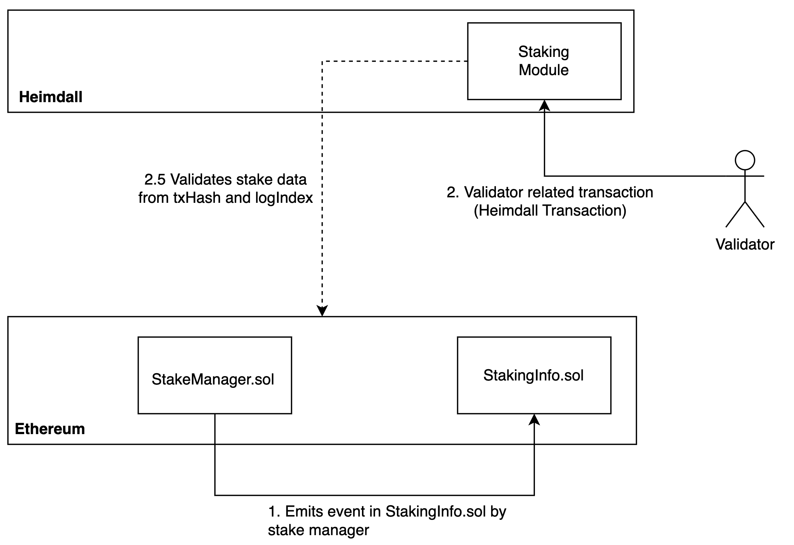
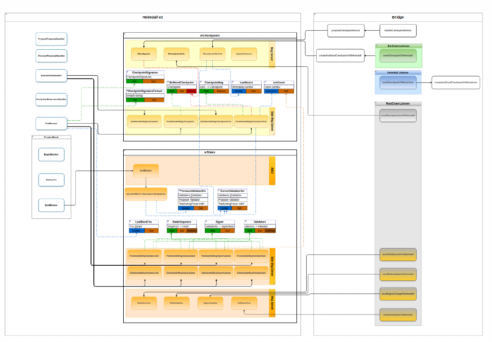

# Stake module

## Table of Contents

* [Overview](#overview)
* [Interact with the Node](#interact-with-the-node)
  * [Tx Commands](#tx-commands)
  * [CLI Query Commands](#cli-query-commands)
  * [GRPC Endpoints](#grpc-endpoints)
  * [REST Endpoints](#rest-apis)

## Overview

This module manages the validators' related transactions and state for GiltConsensus.
Validators are approved by Gold Chain and then submit native `GILT` stake and validator keys directly on GiltConsensus.
Ethereum staking events must not add validators, update validator stake, change signer keys, or start validator exit in the final Gold Chain validator lifecycle.
The bridge remains responsible for valid asset, checkpoint, and state-sync flows, not for controlling validator admission.



## Flow

The x/stake module manages validator-related transactions and validator set management for GiltConsensus v2.
Validator lifecycle messages are native Gold Chain transactions:
- `MsgApproveValidator`: records Gold Chain approval for a validator candidate.
- `MsgValidatorJoin`: adds a validator only when the submitted operator, signer key, activation epoch, and `GILT` stake match a prior approval.
- `MsgStakeUpdate`: increases native self-staked `GILT` under Gold Chain rules.
- `MsgValidatorExit`: starts native validator exit under Gold Chain rules.
- `MsgSignerUpdate`: updates the signer key only under native validation and approval rules.
These messages are not proofs of Ethereum staking events.

### Replay Prevention Mechanism
Native validator lifecycle messages use validator nonce checks and approval state instead of Ethereum block-number/log-index replay keys.
This prevents duplicate or out-of-order validator lifecycle changes without depending on Ethereum staking events.

### Updating the Validator Set
In the x/stake `EndBlocker`, GiltConsensus updates the validator set (through the `ApplyAndReturnValidatorSetUpdates`function), ensuring consensus reflects the latest validator changes.  
Before any updates, the current block’s validator set is stored as the previous block’s set. The system retrieves all existing validators, the current validator set, and the acknowledgment count from the x/checkpoint state.  
Using `GetUpdatedValidators`, a list of validators that require updates (`setUpdates`) is identified and applied through `UpdateWithChangeSet`, storing the new set under `CurrentValidatorSetKey`.  
To maintain fair block proposer selection, GiltConsensus implements a proposer priority system, ensuring all validators have a fair chance to propose new blocks.  
The proposer priority is dynamically adjusted using `IncrementProposerPriority(times int)`, which prevents any validator from monopolizing block proposals.  
This function limits priority differences by re-scaling priorities (`RescalePriorities(diffMax)`) and shifting values based on the average proposer priority (`shiftByAvgProposerPriority()`).  
During each round, the validator with the highest priority is selected as the proposer, after which their priority is adjusted to prevent indefinite accumulation.  
These mechanisms collectively ensure efficient and fair validator rotation, maintaining a balanced consensus process while preventing priority overflows and unfair selection biases.



## Messages

### MsgApproveValidator

`MsgApproveValidator` defines the native Gold Chain approval gate for validator admission.

```protobuf
message MsgApproveValidator {
  option (cosmos.msg.v1.signer) = "from";
  option (amino.name) = "giltconsensusv2/stake/MsgApproveValidator";
  option (gogoproto.equal) = false;
  option (gogoproto.goproto_getters) = true;
  string from = 1 [
    (amino.dont_omitempty) = true,
    (cosmos_proto.scalar) = "cosmos.AddressString"
  ];
  uint64 val_id = 2 [ (amino.dont_omitempty) = true ];
  string operator = 3 [
    (amino.dont_omitempty) = true,
    (cosmos_proto.scalar) = "cosmos.AddressString"
  ];
  uint64 activation_epoch = 4 [ (amino.dont_omitempty) = true ];
  string max_gilt_stake = 5 [
    (gogoproto.nullable) = false,
    (gogoproto.customtype) = "cosmossdk.io/math.Int",
    (amino.dont_omitempty) = true
  ];
  bytes signer_pub_key = 6 [ (amino.dont_omitempty) = true ];
  uint64 nonce = 7 [ (amino.dont_omitempty) = true ];
}
```

### MsgValidatorJoin

`MsgValidatorJoin` defines a message for a node to join the network as validator.

Here is the structure for the transaction message:

```protobuf
//  MsgValidatorJoin defines a message for a new validator to join the network
message MsgValidatorJoin {
  option (cosmos.msg.v1.signer) = "from";
  option (amino.name) = "giltconsensusv2/stake/MsgValidatorJoin";
  option (gogoproto.equal) = false;
  option (gogoproto.goproto_getters) = true;
  string from = 1 [
    (amino.dont_omitempty) = true,
    (cosmos_proto.scalar) = "cosmos.AddressString"
  ];
  uint64 val_id = 2 [ (amino.dont_omitempty) = true ];
  uint64 activation_epoch = 3 [ (amino.dont_omitempty) = true ];
  string amount = 4 [
    (gogoproto.nullable) = false,
    (gogoproto.customtype) = "cosmossdk.io/math.Int",
    (amino.dont_omitempty) = true
  ];
  bytes signer_pub_key = 5 [ (amino.dont_omitempty) = true ];
  reserved 6, 7, 8;
  reserved "tx_hash", "log_index", "block_number";
  uint64 nonce = 9 [ (amino.dont_omitempty) = true ];
}
```

### MsgStakeUpdate

`MsgStakeUpdate` defines a native Gold Chain message for a validator to increase self-staked `GILT`.

```protobuf
message MsgStakeUpdate {
  option (cosmos.msg.v1.signer) = "from";
  option (amino.name) = "giltconsensusv2/stake/MsgStakeUpdate";
  option (gogoproto.equal) = false;
  option (gogoproto.goproto_getters) = true;
  string from = 1 [
    (amino.dont_omitempty) = true,
    (cosmos_proto.scalar) = "cosmos.AddressString"
  ];
  uint64 val_id = 2 [ (amino.dont_omitempty) = true ];
  string new_amount = 3 [
    (gogoproto.nullable) = false,
    (amino.dont_omitempty) = true,
    (gogoproto.customtype) = "cosmossdk.io/math.Int"
  ];
  reserved 4, 5, 6;
  reserved "tx_hash", "log_index", "block_number";
  uint64 nonce = 7 [ (amino.dont_omitempty) = true ];
}
```

### MsgSignerUpdate

`MsgSignerUpdate` defines a message for updating the signer of the existing validator.

```protobuf
message MsgSignerUpdate {
  option (cosmos.msg.v1.signer) = "from";
  option (amino.name) = "giltconsensusv2/stake/MsgSignerUpdate";
  option (gogoproto.equal) = false;
  option (gogoproto.goproto_getters) = true;
  string from = 1 [
    (amino.dont_omitempty) = true,
    (cosmos_proto.scalar) = "cosmos.AddressString"
  ];
  uint64 val_id = 2 [ (amino.dont_omitempty) = true ];
  bytes new_signer_pub_key = 3 [ (amino.dont_omitempty) = true ];
  reserved 4, 5, 6;
  reserved "tx_hash", "log_index", "block_number";
  uint64 nonce = 7 [ (amino.dont_omitempty) = true ];
}
```

### MsgValidatorExit

`MsgValidatorExit` defines a message for a validator to exit the network.

```protobuf
message MsgValidatorExit {
  option (cosmos.msg.v1.signer) = "from";
  option (amino.name) = "giltconsensusv2/stake/MsgValidatorExit";
  option (gogoproto.equal) = false;
  option (gogoproto.goproto_getters) = true;
  string from = 1 [
    (amino.dont_omitempty) = true,
    (cosmos_proto.scalar) = "cosmos.AddressString"
  ];
  uint64 val_id = 2 [ (amino.dont_omitempty) = true ];
  reserved 3, 4, 5, 6;
  reserved "deactivation_epoch", "tx_hash", "log_index", "block_number";
  uint64 nonce = 7 [ (amino.dont_omitempty) = true ];
}
```

## Interact with the Node

### Tx Commands

#### Approve Validator
```bash
giltconsd tx stake approve-validator [val-id] [operator] [activation-epoch] [max-gilt-stake] [signer-pubkey] [nonce]
```

#### Validator Join
```bash
giltconsd tx stake validator-join [val-id] [activation-epoch] [amount] [signer-pubkey] [nonce]
```

#### Signer Update
```bash
giltconsd tx stake signer-update [val-id] [new-signer-pubkey] [nonce]
```

#### Stake Update
```bash
giltconsd tx stake stake-update [val-id] [new-amount] [nonce]
```

#### Validator Exit
```bash
giltconsd tx stake validator-exit [val-id] [nonce]
```

### CLI Query Commands

One can run the following query commands from the stake module:

* `current-validator-set` - Query all validators that are currently active in the validators' set
* `signer` - Query validator info for given validator address
* `validator` - Query validator info for a given validator id
* `validator-status` - Query validator status for given validator address
* `total-power` - Query total power of the validator set
* `is-old-tx` - Check if a tx is old (already submitted)

```bash
giltconsd query stake current-validator-set
```

```bash
giltconsd query stake signer [val_address]
```

```bash
giltconsd query stake validator [id]
```

```bash
giltconsd query stake validator-status [val_address]
```

```bash
giltconsd query stake total-power
```

```bash
giltconsd query stake is-old-tx [txHash] [logIndex]
```

### GRPC Endpoints

The endpoints and the params are defined in the [stake/query.proto](/proto/giltconsensusv2/stake/query.proto) file.
Please refer to them for more information about the optional params.

```bash
grpcurl -plaintext -d '{}' localhost:9090 giltconsensusv2.stake.Query/GetCurrentValidatorSet
```

```bash
grpcurl -plaintext -d '{"val_address": <>}' localhost:9090 giltconsensusv2.stake.Query/GetSignerByAddress
```

```bash
grpcurl -plaintext -d '{"id": <>}' localhost:9090 giltconsensusv2.stake.Query/GetValidatorById
```

```bash
grpcurl -plaintext -d '{"val_address": <>}' localhost:9090 giltconsensusv2.stake.Query/GetValidatorStatusByAddress
```

```bash
grpcurl -plaintext -d '{}' localhost:9090 giltconsensusv2.stake.Query/GetTotalPower
```

```bash
grpcurl -plaintest -d '{"times": <>}' localhost:9090 giltconsensusv2.stake.Query/GetProposersByTimes
```

## REST APIs

The endpoints and the params are defined in the [stake/query.proto](/proto/giltconsensusv2/stake/query.proto) file.
Please refer to them for more information about the optional params.

```bash
curl localhost:1317/stake/validators-set
```

```bash
curl localhost:1317/stake/signer/{val_address}
```

```bash
curl localhost:1317/stake/validator/{id}
```


```bash
curl localhost:1317/stake/validator-status/{val_address}
```

```bash
curl localhost:1317/stake/total-power
```

```bash
curl localhost:1317/stake/proposers/{times}
```
